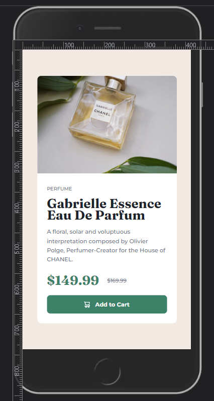

# Frontend Mentor - Product preview card component solution

This is a solution to the [Product preview card component challenge on Frontend Mentor](https://www.frontendmentor.io/challenges/product-preview-card-component-GO7UmttRfa).

## Overview

 

 

## Screenshot

### Desktop Version

### Mobile Version

### Links

- [Solution in Front End Mentor Site:](https://www.frontendmentor.io/solutions/product-preview-card-using-tailwind-fjl-rBAsXq)
- [Live Site](https://product-preview-ten-kappa.vercel.app/)

## My process

Another basic project I redid using Tailwind, this time I added some responsiveness and a simple hover effect.

## Author

- Frontend Mentor - [@VitorMagnago](https://www.frontendmentor.io/profile/VitorMagnago)
